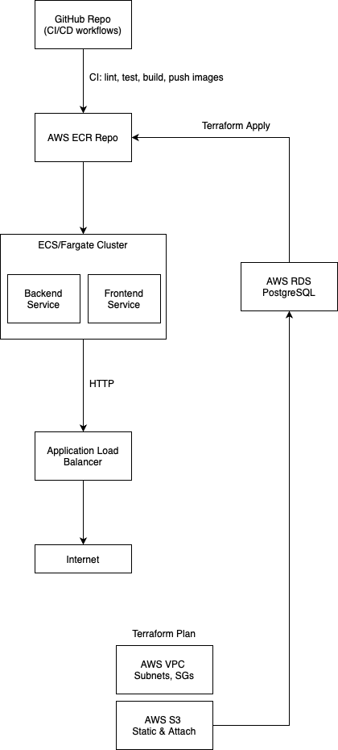

# premium-notes-app
The main goal of this project is for me to learn about the DevOps methodology and AWS tools. The code is not so complex but not so simple either. Premium Notes App is a full-stack web application (React + TailwindCSS frontend, Node.js + Express + PostgreSQL backend) that lets users manage and share notes. It offers a **Free Plan** with basic features and a **Premium Plan** (integrated with Stripe) for advanced capabilities.

---

## 🏗 Architecture

  
High-level overview:  
- **Frontend** (React + TailwindCSS) served via S3 + CloudFront  
- **Backend** (Express) running on ECS/Fargate containers  
- **Database** PostgreSQL on RDS  
- **File Storage** on S3  
- **CI/CD** with GitHub Actions and Terraform  

---

## ⚙️ Features

### Free Plan
- **Sign Up & Login** with email/password (JWT).  
- **Notes CRUD**:
  - Create, read, update, and delete notes (title, content, tags).  
- **Public Sharing**: generate a read-only link for any note.
- **Custom Themes**: choose UI themes (light/dark or color schemes).
- **Health Check** (`GET /health`).

### Premium Plan (Stripe)
- **File Attachments**: upload images or PDFs to notes, stored in S3.  
- **Version History**: view and restore previous versions of a note.  
- **Increased Limits**: up to 1,000 notes (vs. 100 in Free).  

---

## 🚀 Getting Started

Prerequisites
- [Node.js ≥ 18](https://nodejs.org/)  
- [Docker & Docker Compose](https://docs.docker.com/)  
- [Terraform ≥ 1.2](https://www.terraform.io/)  
- [AWS CLI](https://aws.amazon.com/cli/)  
- [Stripe CLI](https://stripe.com/docs/stripe-cli)  

Installation
1. Clone the repo  
   ```bash
   git clone https://github.com/<your-username>/premium-notes-app.git
   cd premium-notes-app
```

2. Copy environment examples

   ```bash
   cp backend/.env.example backend/.env
   cp frontend/.env.example frontend/.env
   ```
3. Fill in your `.env` files (AWS credentials, Stripe keys, DB URL, JWT\_SECRET).

---

🔧 Local Development

Bring everything up with Docker:

```bash
docker-compose up --build
```

* **Frontend**: [http://localhost:3000](http://localhost:3000)
* **Backend**:  [http://localhost:5000](http://localhost:5000)
* **Health Check**: [http://localhost:5000/health](http://localhost:5000/health)

---

## ☁️ AWS Deployment

1. Initialize and apply Terraform

   ```bash
   cd infra/terraform
   terraform init
   terraform apply
   ```
2. Run the build & deploy script

   ```bash
   cd infra/scripts
   ./setup.sh
   ```

This will provision VPC, RDS, ECR, ECS/Fargate, S3, CloudFront, and deploy your app.

---

## 🛠 CI/CD Pipelines

* CI (`.github/workflows/ci.yml`):
  * Lint → Tests → Build Docker → Push to GitHub Packages/Docker Hub.

* CD (`.github/workflows/cd.yml`):
  * On push to `main` → AWS login → Push to ECR → Terraform apply → ECS update.

---

## 📊 Monitoring & Logging

* CloudWatch Logs collects container stdout/stderr.
* Container Insights for CPU, memory, and latency metrics.
* Dashboards and alarms defined via Terraform in `infra/terraform`.

---

## 🔐 Security & Cost Management

* IAM roles with least-privilege for ECS, ECR, RDS, S3.
* SSL/TLS via ACM on the Application Load Balancer.
* Resource tagging (`Project=PremiumNotesApp`, `Owner=<Martin Vega>`).
* AWS Cost Explorer budgets and alerts.

---

## 📚 Documentation

* **8Infrastructure as Code**: `docs/terraform.md`
* **CI/CD**: `docs/ci-cd.md`
* **ECS / K8s**: `docs/ecs-or-k8s.md`
* **Monitoring**: `docs/monitoring.md`
* **Architecture**: `docs/architecture.md`
* **Tooling**: `docs/tooling.md`
* **AWS IAM & Networking**: `docs/aws-iam.md`, `docs/aws-networking.md`
* **Planning & Checklists**: `docs/terraform-plan.md`, `docs/monitoring-plan.md`

---

## 📑 Slide Deck

See `slides_outline.md` for the 5–7 slide presentation outline.

---

## 🚧 Next Steps & Improvements

* Add offline support (PWA) to the frontend.
* Real-time updates via WebSockets.
* Automated rollback in CI/CD.
* Migrate to EKS + Helm.

---

## 📄 License

MIT © 2025 <Martin Vega>

---

## 📬 Contact

* Author: Martín Vega
* Email: josemartinvt2003@email.com

```
```
