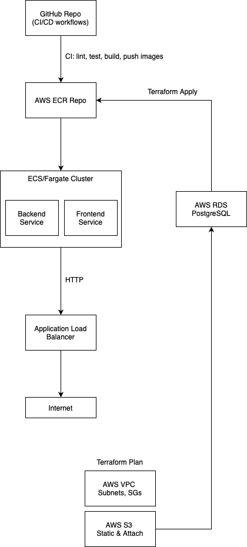

# Architecture Overview

This document describes the main components of the Premium Notes App and their responsibilities.

## Component Responsibilities

- **GitHub Repository & CI/CD**
  Hosts the source code and runs GitHub Actions workflows for:
  - Linting and testing (frontend + backend).
  - Building Docker images.
  - Pushing images to AWS ECR.
  - Running Terraform plan/apply.
  - Deploying to ECS/Fargate.

- **AWS ECR (Elastic Container Registry)**
  Private container registry for:
  - Backend API image.
  - Frontend static site image (Nginx).

- **ECS / Fargate Cluster**
  Serverless container runtime hosting:
  - **Backend Service**: Express API, handles auth, notes CRUD, Stripe webhooks.
  - **Frontend Service**: Nginx-served React app (built via Docker).

- **Application Load Balancer (ALB)**
  Distributes incoming HTTP(S) traffic to the ECS services:
  - Listens on ports 80/443.
  - Terminates SSL/TLS via ACM certificates.
  - Routes `/api/*` to the Backend and `/*` to the Frontend.

- **AWS RDS (PostgreSQL)**
  Managed relational database storing:
  - `users`, `notes`, `note_versions`, `attachments`, `subscriptions`.

- **AWS S3**
  - **Static Hosting** (optional): holds the production build of the frontend if served directly via CloudFront.
  - **Attachments Bucket**: stores user-uploaded images/PDFs; mapped to note IDs.

- **AWS VPC, Subnets & Security Groups**
  Provides network isolation and controls:
  - Public & private subnets.
  - Security Groups:
    - ALB SG allows HTTP(S) from the Internet.
    - ECS tasks SG allows inside-VPC traffic to RDS.
    - RDS SG restricts access to ECS only.

- **Terraform Configuration**
  Infrastructure as Code defining all AWS resources:
  - `providers.tf`, `variables.tf`, `main.tf`, `outputs.tf`.
  - Resource modules for VPC, RDS, ECR, ECS, S3, IAM roles, ALB.

- **AWS CloudFront** (optional)
  CDN in front of S3 for low-latency distribution of static assets.

- **AWS Secrets Manager / Parameter Store**
  Securely stores:
  - Database credentials.
  - Stripe API keys.
  - JWT secret.

- **CloudWatch & Container Insights**
  Monitoring and logging:
  - Aggregates stdout/stderr logs from containers.
  - Tracks CPU, memory, request latency metrics.
  - Sends alarms on error rates or high resource usage.
